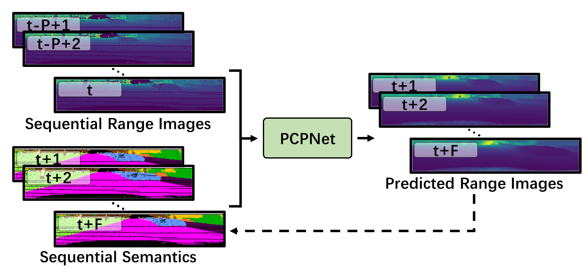
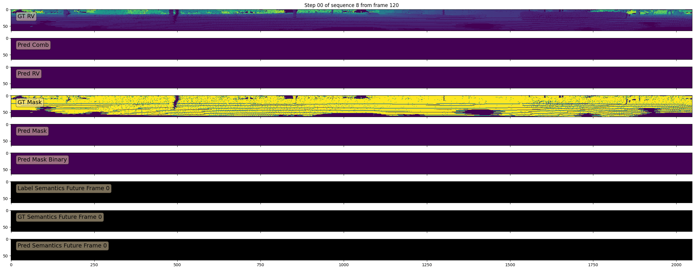
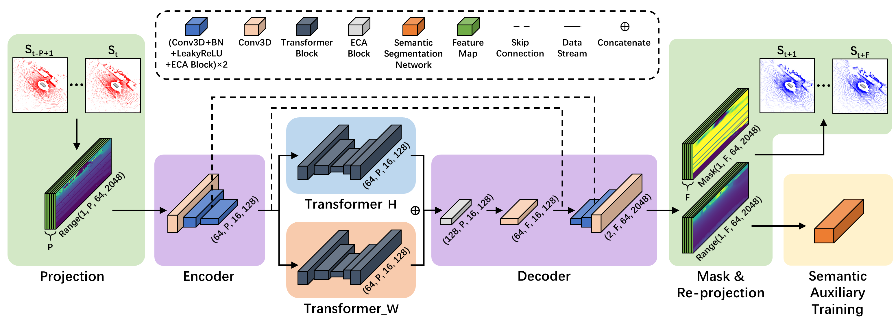

# PCPNet: An Efficient and Semantic-Enhanced Transformer Network for Point Cloud Prediction

Accepted by IEEE RA-L.

Developed by [Zhen Luo](https://github.com/Blurryface0814) and [Junyi Ma](https://github.com/BIT-MJY).



*PCPNet predicts future range images based on past range image sequences. The semantic information of sequential range images is extracted for auxiliary training, making the outputs of PCPNet closer to the ground truth in semantics.*



*Ground truth and future range images predicted by PCPNet.*

## Contents
1. [Publication](#Publication)
2. [Dataset](#Dataset)
3. [Installation](#Installation)
4. [Training](#Training)
5. [Semantic-Auxiliary-Training](#Semantic-Auxiliary-Training)
6. [Testing](#Testing)
7. [Visualization](#Visualization)
8. [Download](#Dwnload)
9. [Acknowledgment](#Acknowledgment)
10. [License](#License)


*Overall architecture of our proposed PCPNet. The input range images are first downsampled and compressed along the height and width dimensions respectively to generate the sentence-like features for the following Transformer blocks. The enhanced features are then combined and upsampled to the predicted range images and mask images. Semantic auxiliary training is used to improve the practical value of predicted point clouds.*

## Publication
If you use our code in your academic work, please cite the corresponding [paper](https://arxiv.org/abs/2304.07773):
    
```latex
@misc{luo2023pcpnet,
      title={PCPNet: An Efficient and Semantic-Enhanced Transformer Network for Point Cloud Prediction}, 
      author={Zhen Luo and Junyi Ma and Zijie Zhou and Guangming Xiong},
      year={2023},
      eprint={2304.07773},
      archivePrefix={arXiv},
      primaryClass={cs.CV}
}
```

## Dataset
We use the KITTI Odometry dataset to train and evaluate PCPNet in this repo, which you can download [here](http://www.cvlibs.net/datasets/kitti/eval_odometry.php).


Besides, we use SemanticKITTI for semantic auxiliary training, which you can download [here](http://semantic-kitti.org/dataset.html#download).

## Installation

### Source Code
Clone this repository and run 
```bash
cd PCPNet
git submodule update --init
```
to install the Chamfer distance submodule. The Chamfer distance submodule is originally taken from [here](https://github.com/chrdiller/pyTorchChamferDistance) with some modifications to use it as a submodule.

All parameters are stored in ```config/parameters.yaml```.

### Dependencies
In this project, we use CUDA 11.4, pytorch 1.8.0 and pytorch-lightning 1.5.0. All other dependencies are managed with Python Poetry and can be found in the ```poetry.lock``` file. If you want to use Python Poetry, install it with:
```bash
curl -sSL https://raw.githubusercontent.com/python-poetry/poetry/master/install-poetry.py | python -
```

Install Python dependencies with Python Poetry
```bash
poetry install
```

and activate the virtual environment in the shell with
```bash
poetry shell
```

## Training
We process the data in advance to speed up training. The preprocessing is automatically done if ```GENERATE_FILES``` is set to True in ```config/parameters.yaml```.

If you have not pre-processed the data yet, please set ```GENERATE_FILES: True``` in ```config/parameters.yaml```, and run the training script by
```bash
python train.py --rawdata /PATH/TO/RAW/KITTI/dataset/sequences --dataset /PATH/TO/PROCESSED/dataset/
```
in which ```--rawdata``` points to the directory containing the train/val/test sequences specified in the config file and  ```--dataset``` points to the directory containing the processed train/val/test sequences

If you have already pre-processed the data, please set ```GENERATE_FILES: False``` to skip this step, and run the training script by
```bash
python train.py --dataset /PATH/TO/PROCESSED/dataset/
```

To resume from a checkpoint, please run the training script by
```bash
python train.py --dataset /PATH/TO/PROCESSED/dataset/ --resume /PATH/TO/YOUR/MODEL/
```
You can also use the flag```--weights``` to initialize the weights from a pre-trained model. Pass the flag ```--help``` if you want to see more options.

A directory will be created in ```runs``` which saves everything like the model files, used config, logs, and checkpoint.

## Semantic-Auxiliary-Training
If you want to use our proposed semantic auxiliary training strategy, you need to first pre-train a semantic segmentation model. We provide codes for semantic auxiliary training using RangeNet++ in ```semantic_net/rangenet```. To use these codes, please first clone the [official codes](https://github.com/PRBonn/lidar-bonnetal) of RangeNet++ and train a semantic segmentation model. 

*Note that we recommend using squeezesegV2 backbone without CRF and only use ```range``` in the ```input_depth``` option while training RangeNet++, according to the codes we are currently providing.* If you want to use other backbones, please make corresponding modifications to ```class loss_semantic```  in ```pcpnet/models/loss.py```.

Once you have completed the pre-training, you need to copy the folder containing the pre-trained model to ```semantic_net/rangenet/model/``` and modify ```SEMANTIC_PRETRAINED_MODEL``` in ```config/parameters.yaml```  to the folder name.

After completing the above steps, you can start to use semantic auxiliary training by running the training script by
```bash
python train.py --dataset /PATH/TO/PROCESSED/dataset/
```
*Note* that you need to set ```LOSS_WEIGHT_SEMANTIC``` in ```config/parameters.yaml``` to the weight you want (we recommend 1.0) instead of 0.0 before running the training script.

## Testing
You can evaluate the performance of the model by running
```bash
python test.py --dataset /PATH/TO/PROCESSED/dataset/ --model /PATH/TO/YOUR/MODEL/
```
*Note*: Please use the flag ```-s``` if you want to save the predicted point clouds for visualization, and ```-l``` if you want to test the model on a smaller amount of data. By using the flag ```-o```, you can only save the predicted point clouds without computing loss to accelerate the speed of saving.

## Visualization
After passing the ```-s``` flag or the ```-o```flag to the testing script, the predicted range images will be saved as .png files in ```runs/MODEL_NAME/test_TIME/range_view_predictions```. The predicted point clouds are saved to ```runs/MODEL_NAME/test_TIME/point_clouds```. You can visualize the predicted point clouds by running
```bash
python visualize.py --path runs/MODEL_NAME/test_TIME/point_clouds
```
Please download the car model from [here](https://drive.google.com/drive/folders/1bmBMdfJaN2ptJVh7gHv1Gy8L1aLMOslr?usp=share_link) and put it into ```./car_ model/``` to display the car during the visualization process.


## Download
You can download our pre-trained model from this [link](https://drive.google.com/drive/folders/1p9q_SoXOsigi8vB_bXxWNZbU-ypSm19J?usp=share_link). Just extract the zip file into ```runs```.

## Acknowledgment
We would like to thank Benedikt Mersch, Andres Milioto and Christian Diller et al. for their significant contributions in the field of point cloud processing. Some of the code in this repo is borrowed from [TCNet](https://github.com/PRBonn/point-cloud-prediction), [RangeNet++](https://github.com/PRBonn/lidar-bonnetal), and [pyTorchChamferDistance](https://github.com/chrdiller/pyTorchChamferDistance). Thank all the authors for their awesome projects.

## License
This project is free software made available under the MIT License. For details see the LICENSE file.
